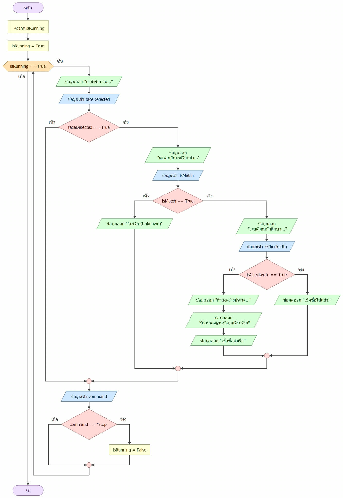
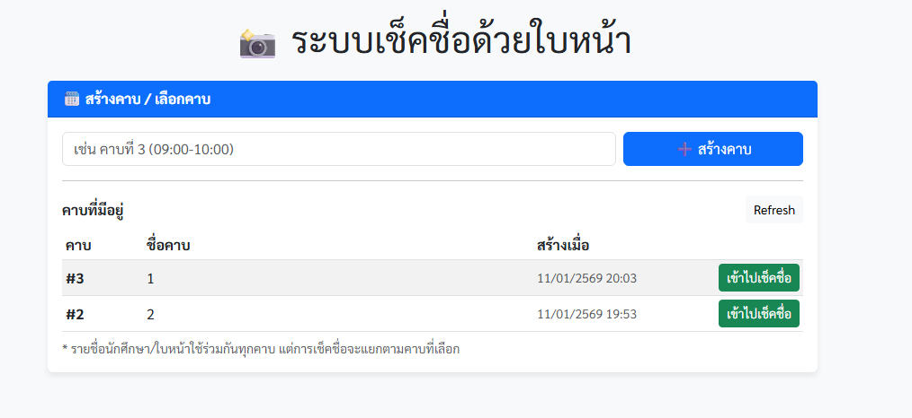
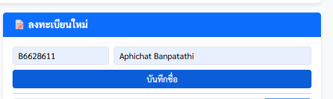
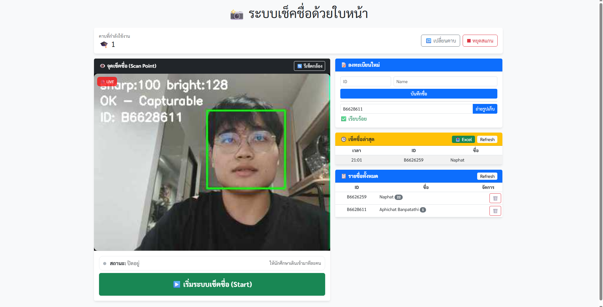
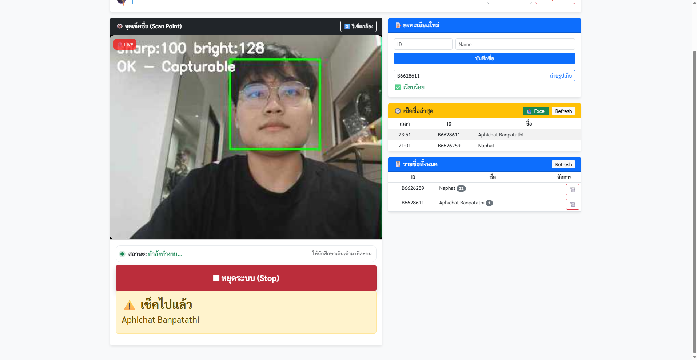

# รายงานโครงงานรายวิชา ENG23 3054 ระบบปฏิบัติการ
**หัวข้อโครงงาน (ภาษาไทย):** ระบบเช็คชื่อเข้าเรียนอัจฉริยะด้วยการจดจำใบหน้า (Smart Face Attendance)
**หัวข้อโครงงาน (ภาษาอังกฤษ):** Smart Face Attendance System using Face Recognition on Raspberry Pi

---

## 📋 ข้อมูลเบื้องต้น

| รายละเอียด | ข้อมูล |
| :--- | :--- |
| **รายวิชา** | ENG23 3054 ระบบปฏิบัติการ (Operating Systems) |
| **กลุ่มที่** | [6] |
| **กลุ่มเรียนที่** | [2] |
| **สาขาวิชา** | วิศวกรรมคอมพิวเตอร์ สำนักวิชาวิศวกรรมศาสตร์ |
| **สถาบัน** | มหาวิทยาลัยเทคโนโลยีสุรนารี |
| **ปีการศึกษา** | 2568 |

### 👥 คณะผู้จัดทำ

| ลำดับ | ชื่อ - สกุล | รหัสนักศึกษา |
| :---: | :--- | :--- |
| 1 | [นายธนภัทร เย็นสวัสดิ์] | B6615994 |
| 2 | [นายณภัทร ศรีสุจันทร์] | B6626259 |
| 3 | [นายอภิชาติ บรรพตะธิ] | B6628611 |
| 4 | [นายพีรพงศ์ ลิมปศรีตระกูล] | B6643577 |

---

## 📑 สารบัญ
1. [บทคัดย่อ (Abstract)](#บทคัดย่อ)
2. [วัตถุประสงค์ (Objectives)](#1-วัตถุประสงค์)
3. [ทฤษฎีที่เกี่ยวข้อง (Related Theories)](#2-ทฤษฎีที่เกี่ยวข้อง)
4. [การออกแบบ (System Design)](#3-การออกแบบ)
5. [ผลการดำเนินงาน (Results)](#4-ผลการดำเนินงาน)
6. [สรุปผลและข้อเสนอแนะ (Conclusion)](#5-สรุปผลการดำเนินงานและข้อเสนอแนะ)
7. [เอกสารอ้างอิง (References)](#เอกสารอ้างอิง)

---

## บทคัดย่อ
> ภาพรวมโครงงาน: โครงงานนี้นำเสนอการพัฒนา "ระบบเช็คชื่อเข้าเรียนด้วยการจดจำใบหน้า (Smart Face Attendance)" ซึ่งเป็นระบบตรวจสอบการเข้าเรียนแบบอัตโนมัติโดยใช้เทคโนโลยีการจดจำใบหน้า (Face Recognition)

ปัญหาที่ต้องการแก้ไข: ระบบการเช็คชื่อแบบดั้งเดิม เช่น การขานชื่อทีละคน หรือการส่งกระดาษให้เซ็นชื่อ มักประสบปัญหาหลายประการ ได้แก่ (1) ความล่าช้าและเสียเวลาในการเรียนการสอน (2) ความผิดพลาดของข้อมูลจากการจดบันทึกหรือเอกสารสูญหาย และ (3) ปัญหาการลงชื่อแทนกัน (Buddy Punching) ซึ่งทำให้ข้อมูลไม่ถูกต้องและไม่สามารถยืนยันตัวตนที่แท้จริงของผู้เรียนได้

วิธีการดำเนินงาน: ระบบนี้ใช้บอร์ด Raspberry Pi 3 ทำหน้าที่เป็นเซิร์ฟเวอร์กลาง (Edge Server) สำหรับประมวลผลภาพใบหน้า โดยใช้ไลบรารี dlib และ face_recognition ในการตรวจจับและเปรียบเทียบใบหน้า มี Flask เป็น Backend API สำหรับรับ-ส่งข้อมูล และใช้ SQLite เป็นฐานข้อมูลสำหรับจัดเก็บข้อมูลนักศึกษา รูปภาพใบหน้าต้นแบบ และประวัติการเข้าเรียน นอกจากนี้ยังมีหน้าเว็บไซต์ (Web UI) สำหรับลงทะเบียนใบหน้า ทำการเช็คชื่อ และตรวจสอบสถานะการเข้าเรียนแบบ Real-time ทั้งระบบถูกพัฒนาภายใต้สถาปัตยกรรม Docker Container เพื่อให้ง่ายต่อการติดตั้ง บำรุงรักษา และนำไปใช้งานบนอุปกรณ์ IoT ได้สะดวก

ผลลัพธ์ที่ได้: ผลการพัฒนาแสดงให้เห็นว่าระบบสามารถยืนยันตัวตนนักศึกษาผ่านการสแกนใบหน้าได้อย่างถูกต้องและรวดเร็ว โดยข้อมูลการเข้าเรียนถูกบันทึกลงฐานข้อมูลโดยอัตโนมัติ ช่วยลดระยะเวลาและภาระงานของผู้สอน ป้องกันการลงชื่อแทนกัน และเพิ่มความน่าเชื่อถือของข้อมูลการเข้าเรียน ซึ่งสามารถนำไปประยุกต์ใช้งานจริงในสถานศึกษาได้

---

## 1. วัตถุประสงค์
1. เพื่อตรวจสอบตัวตนของนักศึกษาผ่านการเช็คชื่อได้อย่างถูกต้องผ่านการสแกนใบหน้า
2. เพื่อประยุกต์ใช้เทคโนโลยีสมัยใหม่มาอำนวยความสะดวกในกระบวนการเช็คชื่อเข้าเรียน
3. เพื่อให้ผู้สอนสามารถตรวจสอบผลการเช็คชื่อและสถานะการเข้าเรียนของนักศึกษาได้แบบ Real-time ผ่านหน้าเว็บไซต์
4. เพื่อจัดเก็บและบันทึกข้อมูลการเข้าเรียนลงในระบบฐานข้อมูลโดยอัตโนมัติ ลดความผิดพลาดของข้อมูล

## 2. ทฤษฎีที่เกี่ยวข้อง
> *อธิบายหลักการ ทฤษฎี หรือเทคโนโลยีที่นำมาใช้ในโครงงานนี้*

### 2.1 [ Haar Cascade Classifier – การตรวจจับใบหน้า ]
*แนวคิดใช้ Machine Learning แบบ Cascade of Boosted Classifiers พัฒนาโดย Viola & Jones (2001) อาศัย Haar-like features   ตรวจจับความแตกต่างระหว่างบริเวณสว่าง-มืดในภาพ 
การใช้งาน ตรวจจับตำแหน่งใบหน้าจากภาพกล้อง โดยสแกนภาพหลายมุม (0°, 90°, -90°)
 

### 2.2 [LBPH (Local Binary Pattern Histogram) – การจดจำใบหน้า ]
* แนวคิดใช้ วิเคราะห์ texture ของใบหน้าโดยคำนวณ Local Binary Pattern ของแต่ละพิกเซล แบ่งภาพเป็น Grid 8x8 แล้วสร้าง Histogram เปรียบเทียบกับข้อมูลที่ train ไว้ 
การใช้งาน ระบุตัวตนว่าใบหน้าที่ตรวจพบตรงกับนักศึกษาคนใด (Confidence < 65 = match)

### 2.3 [Laplacian Variance – การวัดความคมชัดของภาพ ]
* แนวคิดใช้ ใช้ Laplacian operator (second-order derivative) ตรวจจับ edges ในภาพ ค่า Variance สูง = ภาพชัด, ค่าต่ำ = ภาพเบลอ 
การใช้งาน ระบุตัวตนว่าใบหน้าที่ตรวจพบตรงกับนักศึกษาคนใด (Confidence < 65 = match)

### 2.4 [Histogram Equalization – การปรับความสว่างของภาพ  ]
* แนวคิดใช้ กระจายค่า pixel intensity ให้กว้างขึ้น เพิ่ม contrast ของภาพ ทำให้การตรวจจับใบหน้าทำงานได้ดีขึ้นในสภาพแสงต่างกัน 
การใช้งาน ระบุตัวตนว่าใบหน้าที่ตรวจพบตรงกับนักศึกษาคนใด (Confidence < 65 = match)

### 2.5 [Client-Server Architecture (RESTful API) – สถาปัตยกรรมระบบ  ]
* แนวคิดใช้ แยก Frontend และ Backend ออกจากกัน สื่อสารผ่าน HTTP request แบบ stateless ใช้ JSON format 
การใช้งาน Frontend (HTML/JS) เรียก API ไปยัง Backend (Flask) เพื่อลงทะเบียน เช็คชื่อ ดูรายงาน

## 3. การออกแบบ
> *ส่วนนี้แสดงโครงสร้างระบบ (Architecture) หรือ Flowchart การทำงาน*

**แผนภาพกระบวนการทำงาน (System Flowchart)**

*(คำอธิบายรูปภาพ: แผนภาพแสดงลำดับการทำงานของระบบตั้งแต่เริ่มต้นจนจบกระบวนการ)*

**คำอธิบายกระบวนการทำงาน (System Process Description):**

1.  **เริ่มต้น (Start):** โปรแกรมเริ่มทำงานและกำหนดค่าเริ่มต้น `isRunning = True`
2.  **ลูปการทำงานหลัก (Main Loop):** ระบบจะตรวจสอบเงื่อนไข `isRunning` หากเป็นจริงจะทำงานต่อ
3.  **การรับภาพ:** ระบบแสดงสถานะ "กำลังรับภาพ..." เพื่อเตรียมประมวลผล
4.  **ตรวจสอบใบหน้า (Face Detection):**
    *   **ถ้าตรวจพบใบหน้า (`True`):**
        *   ระบบจะดึงเอกลักษณ์ใบหน้า (Feature Extraction) และตรวจสอบว่าตรงกับฐานข้อมูลหรือไม่ (`isMatch`)
        *   **ถ้าตรงกัน (`True`):**
            *   ระบบระบุตัวตนนักศึกษา และตรวจสอบสถานะการเช็คชื่อ (`isCheckedIn`)
            *   *กรณียังไม่เช็คชื่อ:* ทำการสร้างประวัติ -> บันทึกลงฐานข้อมูล -> แสดงผล "เช็คชื่อสำเร็จ!"
            *   *กรณีเช็คชื่อไปแล้ว:* แจ้งเตือน "เช็คชื่อไปแล้ว!"
        *   **ถ้าไม่ตรงกัน (`False`):**
            *   แจ้งเตือน "ไม่รู้จัก (Unknown)"
    *   **ถ้าไม่ตรวจพบใบหน้า (`False`):** ข้ามไปขั้นตอนรอรับคำสั่ง
5.  **ตรวจสอบคำสั่ง (Command Check):**
    *   ระบบรอรับค่า `command`
    *   ถ้าคำสั่งคือ **"stop"**: กำหนด `isRunning = False` เพื่อเตรียมจบการทำงาน
    *   ถ้าไม่ใช่: วนกลับไปเริ่มรับภาพใหม่อีกครั้ง
6.  **จบการทำงาน (End):** เมื่อ `isRunning` เป็นเท็จ

## 4. ผลการดำเนินงาน
> *แสดงภาพหน้าจอ (Screenshots) หรือผลลัพธ์จากการรันโปรแกรม พร้อมคำอธิบาย*

* **ผลลัพธ์ที่ 1: หน้าจอหลัก (User Interface Overview)**
    * 
    * *คำอธิบาย: แสดงหน้าจอ User Interface หลักที่ประกอบด้วยจุดเช็คชื่อ (Scan Point), เมนูลงทะเบียนนักศึกษาใหม่ และตารางแสดงรายชื่อผู้เช็คชื่อล่าสุด*

* **ผลลัพธ์ที่ 2: การสร้างและเลือกคาบเรียน (Period Management)**
    * 
    * *คำอธิบาย: หน้าจอสำหรับสร้างคาเรียนใหม่และเลือกคาบที่ต้องการเปิดระบบเช็คชื่อ*

* **ผลลัพธ์ที่ 3: การลงทะเบียนใบหน้า (Face Enrollment)**
    * 
    * 
    * *คำอธิบาย: ขั้นตอนการกรอกข้อมูลนักศึกษาใหม่และการแจ้งเตือนเมื่อระบบบันทึกใบหน้าและข้อมูลลงฐานข้อมูลสำเร็จ*

* **ผลลัพธ์ที่ 4: การสแกนและจดจำใบหน้า (Face Recognition Process)**
    * 
    * *คำอธิบาย: ระบบทำการตรวจจับใบหน้าจากกล้อง (Live View) และระบุรหัสนักศึกษาโดยอัตโนมัติพร้อมตรวจสอบความคมชัดและแสงสว่าง*

* **ผลลัพธ์ที่ 5: การตรวจสอบสถานะการเช็คชื่อซ้ำ (Duplicate Check)**
    * 
    * *คำอธิบาย: ระบบมีการป้องกันการเช็คชื่อซ้ำ โดยจะแจ้งเตือนหากนักศึกษาคนเดิมพยายามสแกนใบหน้าอีกครั้งในคาบเรียนเดิม*

* **ผลลัพธ์ที่ 6: การรายงานผลการเข้าเรียน (Attendance Report)**
    * 
    * *คำอธิบาย: ระบบสามารถส่งออก (Export) ข้อมูลการเช็คชื่อออกมาในรูปแบบไฟล์ Excel เพื่อความสะดวกในการสรุปผลการเข้าเรียน*

## 5. สรุปผลการดำเนินงานและข้อเสนอแนะ

### 5.1 สรุปผลการดำเนินงาน
จากการพัฒนาโครงงาน "ระบบเช็คชื่อด้วยใบหน้าอัจฉริยะ (Smart Face Attendance)" สามารถสรุปผลการดำเนินงานได้ดังนี้:
1. **ความสำเร็จของระบบ**: สามารถพัฒนาระบบที่ทำงานภายใต้สถาปัตยกรรม Docker Container บนบอร์ด Raspberry Pi ได้สำเร็จ โดยระบบประกอบด้วยส่วนของ Backend (Flask API) และ Frontend (Web Interface) ที่ทำงานร่วมกันได้อย่างมีประสิทธิภาพ
2. **การประมวลผลใบหน้า**: ระบบสามารถตรวจจับและจดจำใบหน้าของนักศึกษาที่ลงทะเบียนไว้ได้อย่างแม่นยำในสภาพแสงที่เหมาะสม โดยใช้ไลบรารี dlib และ face_recognition
3. **การจัดการข้อมูล**: ระบบสามารถบันทึกเวลาเรียนลงในฐานข้อมูล SQLite โดยอัตโนมัติ ป้องกันการเช็คชื่อซ้ำ และสามารถส่งออกรายงานสถานะการเข้าเรียนในรูปแบบไฟล์ Excel ได้
4. **ความสะดวกในการใช้งาน**: ผู้สอนสามารถบริหารจัดการคาบคลาสเรียนและตรวจสอบรายชื่อนักศึกษาที่เข้าเรียนได้ทันทีผ่าน Web Browser ทำให้ลดภาระงานและเวลาในการเช็คชื่อแบบเดิม

### 5.2 ปัญหาและข้อเสนอแนะ
* **ปัญหาที่พบ:**
    1. **ปัจจัยด้านแสงสว่าง**: สภาพแสงมีผลโดยตรงต่อความแม่นยำในการจดจำใบหน้า หากสภาพพื้นหลังมืดเกินไปหรือมีแสงย้อน ระบบอาจทำงานผิดพลาดหรือใช้เวลาประมวลผลนานขึ้น
    2. **มุมมองของกล้อง**: ระบบทำงานได้ดีที่สุดในมุมหน้าตรง หากนักศึกษาเอียงหน้าหรือก้มหน้ามากเกินไป ระบบอาจตรวจไม่พบใบหน้า
    3. **ทรัพยากรระบบ**: เนื่องจากโปรแกรมรันบน Raspberry Pi ซึ่งมีทรัพยากรจำกัด การประมวลผลภาพแบบ Real-time อาจมีความล่าช้า (Delay) เล็กน้อยหากมีการส่งข้อมูลผ่าน Network ที่ไม่เสถียร
* **ข้อเสนอแนะ:**
    1. **การปรับปรุงความแม่นยำ**: ศึกษาการนำโมเดล Deep Learning ที่ซับซ้อนขึ้นมาใช้ และการใช้เทคนิค Anti-spoofing เพื่อป้องกันการใช้รูปภาพถ่ายแทนใบหน้าจริง
    2. **การเพิ่มช่องทางแจ้งเตือน**: พัฒนาฟีเจอร์ส่งการแจ้งเตือนผลการเช็คชื่อผ่าน Line Notify หรือ Email ให้กับนักศึกษาและผู้ปกครองทราบทันที
    3. **การประมวลผลแบบ Edge Computing**: หากต้องการความเร็วที่มากขึ้น ควรพิจารณาใช้บอร์ดรุ่นที่สูงขึ้น หรือใช้โมดูลเสริมสำหรับการประมวลผล AI โดยเฉพาะ เช่น Coral USB Accelerator

---

## เอกสารอ้างอิง

1.  Viola, P., & Jones, M. (2001). *Rapid Object Detection Using a Boosted Cascade of Simple Features*. สืบค้นเมื่อ 21 ธันวาคม 2568, จาก https://www.cs.cmu.edu/~efros/courses/LBMV07/Papers/viola-cvpr-01.pdf
2.  Ahonen, T., Hadid, A., & Pietikäinen, M. (2006). *Face Recognition with Local Binary Patterns*. สืบค้นเมื่อ 21 ธันวาคม 2568, จาก https://link.springer.com/chapter/10.1007/11744085_41
3.  King, D. E. (2009). *Dlib-ml: A Machine Learning Toolkit*. สืบค้นเมื่อ 21 ธันวาคม 2568, จาก http://dlib.net/
4.  Geitgey, A. (2024). *face_recognition: The world's simplest facial recognition api for Python*. สืบค้นเมื่อ 21 ธันวาคม 2568, จาก https://github.com/ageitgey/face_recognition
5.  OpenCV Team. (2024). *OpenCV: Open Source Computer Vision Library*. สืบค้นเมื่อ 21 ธันวาคม 2568, จาก https://opencv.org/
6.  Raspberry Pi Foundation. (2024). *Raspberry Pi Documentation*. สืบค้นเมื่อ 21 ธันวาคม 2568, จาก https://www.raspberrypi.com/documentation/
7.  Pallets Projects. (2024). *Flask: A Python Microframework*. สืบค้นเมื่อ 21 ธันวาคม 2568, จาก https://flask.palletsprojects.com/
8.  Docker Inc. (2024). *Docker Documentation*. สืบค้นเมื่อ 21 ธันวาคม 2568, จาก https://docs.docker.com/
9.  SQLite Consortium. (2024). *SQLite Documentation*. สืบค้นเมื่อ 21 ธันวาคม 2568, จาก https://www.sqlite.org/docs.html
10. Bradski, G., & Kaehler, A. (2008). *Learning OpenCV: Computer Vision with the OpenCV Library*. สืบค้นเมื่อ 21 ธันวาคม 2568, จาก https://www.oreilly.com/library/view/learning-opencv/9780596516130/
11. Ojala, T., Pietikäinen, M., & Mäenpää, T. (2002). *Multiresolution Gray-Scale and Rotation Invariant Texture Classification with Local Binary Patterns*. สืบค้นเมื่อ 21 ธันวาคม 2568, จาก https://ieeexplore.ieee.org/document/1017623
12. Bansal, R., Raj, G., & Choudhury, T. (2016). *Blur image detection using Laplacian operator and Open-CV*. สืบค้นเมื่อ 21 ธันวาคม 2568, จาก https://ieeexplore.ieee.org/document/7860215
13. Gonzalez, R. C., & Woods, R. E. (2018). *Digital Image Processing (4th Edition)*. สืบค้นเมื่อ 21 ธันวาคม 2568, จาก http://www.imageprocessingplace.com/
14. Lavanya, K., Akalyaa, N., Archana, S., & Pushpakala, J. (2024). *Face Recognition based Attendance System*. Shanlax International Journal of Arts, Science and Humanities. สืบค้นเมื่อ 21 ธันวาคม 2568, จาก https://www.researchgate.net/publication/382181519_Face_Recognition_based_Attendance_System